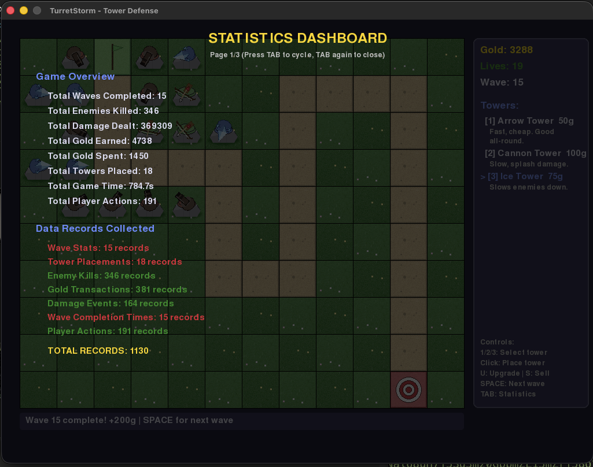
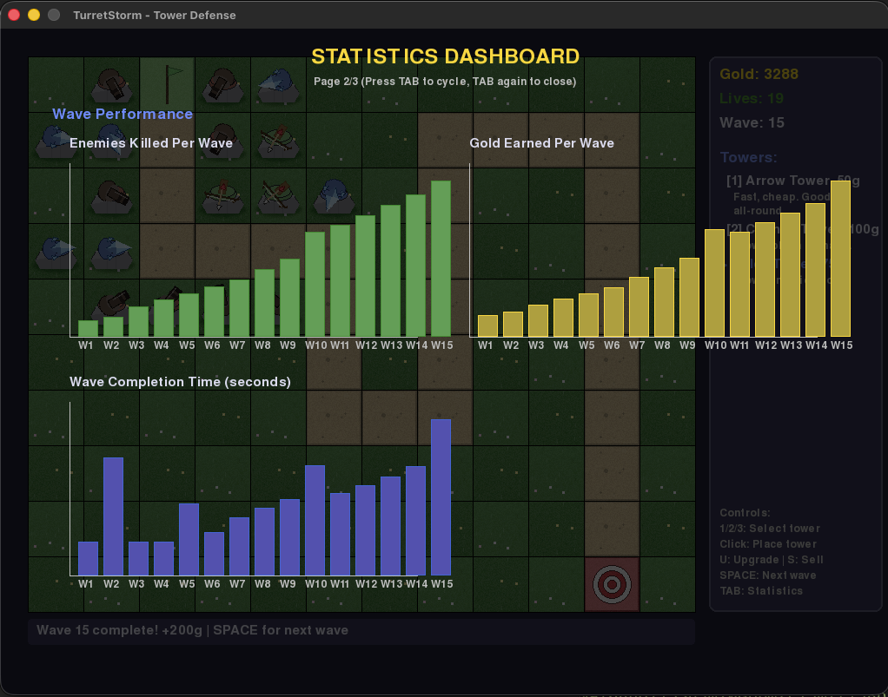
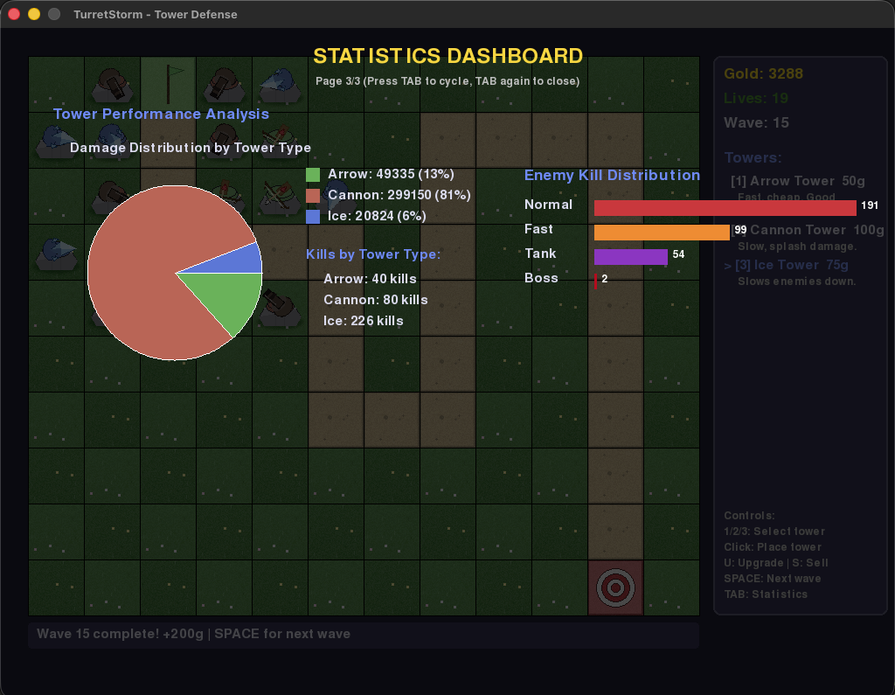
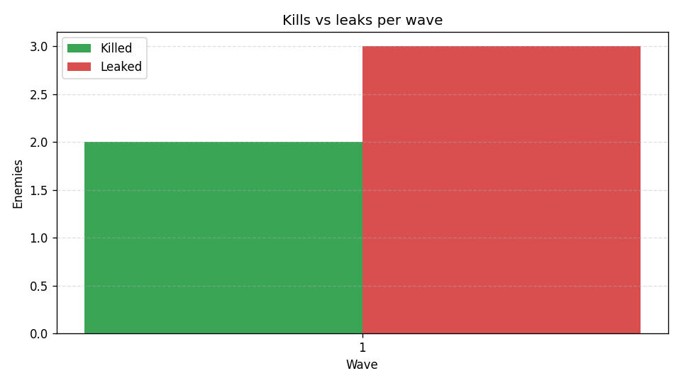
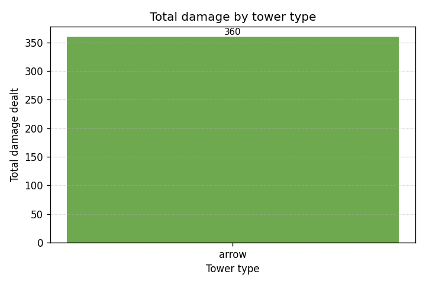
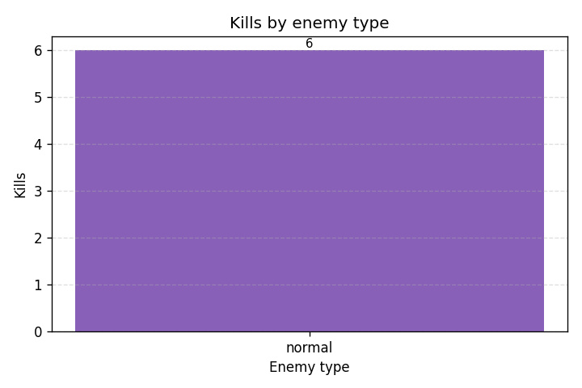
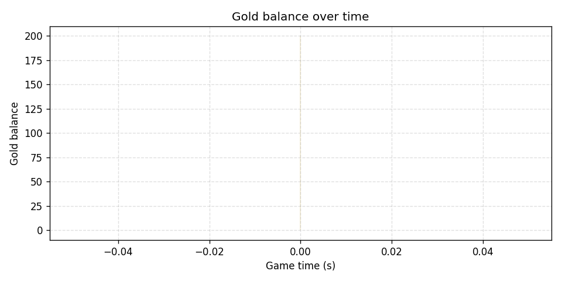
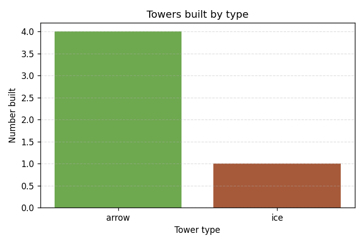
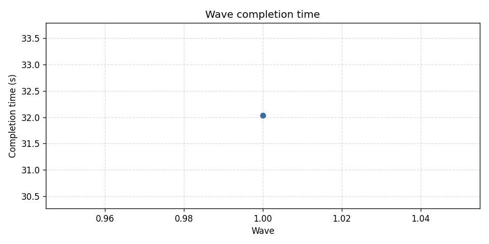

# Data Visualization

This page documents every data-related component produced by Turret
Storm. There are two surfaces the player and grader can inspect:

1. **In-game dashboard** — rendered live by `StatsManager.draw_dashboard`
   and cycled with the **TAB** key while the game is running.
2. **Offline analysis** — produced by `data_analysis.py` after a game
   has ended and `stats_data/*.csv` exists. Output is written to
   `stats_data/analysis/`.

All in-game screenshots below were captured from a real 15-wave
playtest (Wave 15 complete, 3288 gold, 19 lives remaining, 1130 total
records collected across the seven feature tables).

---

## Part A — In-game dashboard (TAB)

The in-game dashboard has three pages, cycled by pressing **TAB**
during play. Every page is rendered over the game world with a
translucent background so the player can tab back to playing at any
time.

### A.1 Page 1 — Game Overview & Data Records



The first page is split into two halves. **Game Overview** (top) shows
the player's lifetime totals for the current run: waves completed,
enemies killed, total damage dealt, gold earned and spent, towers
placed, total game time, and player actions. **Data Records Collected**
(bottom) lists how many rows have been queued in each of the seven
in-memory feature tables, with green text for features that have data
this run and red text for features that are still empty (so the
grader can see at a glance which CSVs will and won't be exported).
The bold `TOTAL RECORDS` line at the bottom is the sum across all
seven tables — 1,130 in this screenshot.

### A.2 Page 2 — Wave Performance



The second page renders three bar charts in a single dashboard view:

- **Enemies Killed Per Wave** (top-left, green) — one bar per wave,
  height = enemies killed that wave. The shape immediately tells the
  player whether enemy counts are scaling as expected.
- **Gold Earned Per Wave** (top-right, gold) — one bar per wave,
  height = gold earned that wave. Lets the player gauge whether
  income is keeping up with rising tower costs.
- **Wave Completion Time (seconds)** (bottom, blue) — one bar per
  wave, height = how long the wave took end-to-end. A wave that takes
  much longer than its neighbours flags either a tough wave (Boss /
  Tank) or a weak build that is barely keeping up.

### A.3 Page 3 — Tower Performance Analysis



The third page focuses on tower-versus-enemy effectiveness and is
split into two visualizations:

- **Damage Distribution by Tower Type** (left, pie chart) — one slice
  per tower type with absolute damage and percentage label. In the
  screenshot the Cannon contributed 81% of the run's total damage
  (299,150), Arrow 13% (49,335), and Ice 6% (20,824), which makes the
  splash-damage strategy obvious without reading any numbers. The
  `Kills by Tower Type` legend next to the pie shows per-tower-type
  kill totals — useful because Ice towers can dominate kills (226)
  without dominating damage.
- **Enemy Kill Distribution** (right, horizontal bars) — one bar per
  enemy type with the kill count printed at the right end of the bar.
  In the screenshot Normal enemies dominated (191), then Fast (99),
  Tank (54), and Boss (2). A short Tank or Boss bar implies the
  current build is under-equipped against high-HP targets.

---

## Part B — Offline analysis (`data_analysis.py`)

After a game ends, `main.py` calls `StatsManager.save_to_csv()`, which
writes seven CSVs into `stats_data/`. Running `python data_analysis.py`
from the project root then produces one CSV and six PNG charts inside
`stats_data/analysis/`, described below.

### B.1 Kills vs leaks per wave — `01_kills_vs_leaks_per_wave.png`



A side-by-side bar chart with one pair of bars per wave: green bars
for `enemies_killed`, red bars for `enemies_leaked`. This is the
single most important chart for evaluating tower placement — any wave
where the red bar approaches or exceeds the green bar is a wave where
the current build lost a significant fraction of enemies.

### B.2 Total damage by tower type — `02_damage_by_tower.png`



A single bar chart with one bar per tower type (Arrow / Cannon / Ice),
height = total damage dealt across the whole run. Numeric labels
appear above each bar. This reveals which tower *type* (not tile)
contributed most to the run: a dominant Cannon bar implies the player
relied on splash; a thin Ice bar with lots of kills implies Ice towers
were effective *control* rather than *damage* pieces.

### B.3 Kills by enemy type — `03_kills_by_enemy.png`



A single bar chart with one bar per enemy type (`normal`, `fast`,
`tank`, `boss`), height = number of kills. Numeric labels above bars.
It lets us spot systemic weaknesses such as low tank kill counts
(implies not enough raw damage) or fast enemies slipping through
(implies not enough slow or coverage near the start).

### B.4 Gold balance over time — `04_gold_over_time.png`



A line chart of `balance` vs `game_time`, pulled directly from
`gold_transactions.csv` where every transaction already stores the
post-transaction running balance. The area below the line is filled
for readability. This turns the run into a single curve: smooth
upward slopes are farming waves; sudden dips are tower purchases or
upgrades; long flat sections are the player holding gold for a bigger
purchase.

### B.5 Towers built by type — `05_towers_built.png`



A bar chart with one bar per tower type, height = number of towers
*built* across the whole run. Combined with B.2 this separates
"damage per tower" from "damage per build": a tower type with few
builds but high damage is efficient; a tower type with many builds
but low damage is probably over-placed.

### B.6 Wave completion time — `06_wave_completion_time.png`



A line chart of `wave_time` vs `wave`. Waves should get longer with
increasing wave number because enemy counts scale; a flat or
*decreasing* line deep into the game is a sign that the current
build is overtuned for the current wave and the player can start
spending on bigger towers.

### B.7 Wave summary CSV — `wave_summary.csv`

A tabular export with one row per wave and an extra computed
`kill_rate` column (`enemies_killed / (enemies_killed + enemies_leaked)`).
This is the single-file version of the whole run for pasting into
spreadsheets or reports.

---

## Data pipeline summary

```
               +-------------------+
 in-game       |  StatsManager     |---TAB--> in-game dashboard (3 pages)
 events  --->  |  (7 record_*      |
               |   methods)        |
               +---------+---------+
                         |
                         | save_to_csv() at every wave end + on quit
                         v
                 stats_data/*.csv  (7 files)
                         |
                         | python data_analysis.py
                         v
                stats_data/analysis/
                  ├─ 01_kills_vs_leaks_per_wave.png
                  ├─ 02_damage_by_tower.png
                  ├─ 03_kills_by_enemy.png
                  ├─ 04_gold_over_time.png
                  ├─ 05_towers_built.png
                  ├─ 06_wave_completion_time.png
                  └─ wave_summary.csv
```
